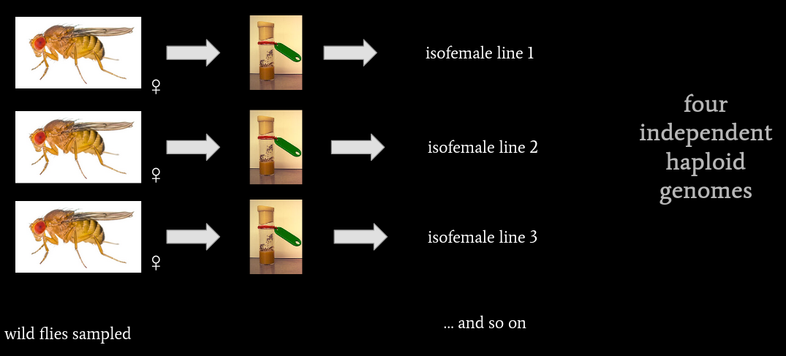
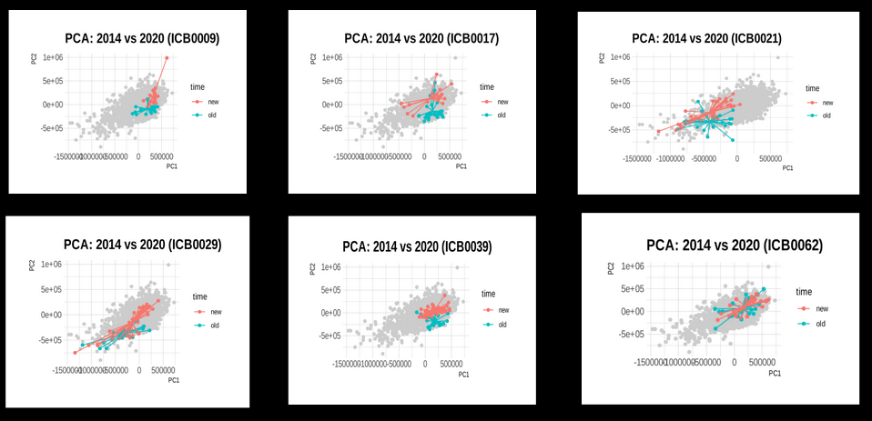

```{r setup, include=FALSE}
options(htmltools.dir.version = FALSE)
library(xaringanthemer)
style_mono_accent_inverse(base_color = "#909090", header_color = '#FFFFFF', title_slide_text_color = "#000000")
```

---

class: center

## Similar. Yet so different.!

.pull-left[


*Papilio paris*

<a href="https://commons.wikimedia.org/wiki/File:Close_wing_position_of_Papilio_paris,_Linnaeus,_1758_%E2%80%93_Paris_Peacock_WLB.jpg">Sayan Sanyal</a>, <a href="https://creativecommons.org/licenses/by-sa/4.0">CC BY-SA 4.0</a>, via Wikimedia Commons
]

.pull-right[


*Papilio helenus*

<a href="https://commons.wikimedia.org/wiki/File:Papilio_helenus_fortunius_male_20131027.jpg">Peellden</a>, <a href="https://creativecommons.org/licenses/by-sa/4.0">CC BY-SA 4.0</a>, via Wikimedia Commons
]

---

### Why do some organisms look similar and some dissimilar?

.pull-left[]

.pull-right[]

.footnote[Comte de Buffon (1791) *Histoire naturelle, générale et particuliére*]

???
- buffon- importance of father of evo
- Similarities between different organisms were well known and a source of fascination.
- farmers had known for millennia, crops- better yield etc
- Many have tried to explain 
- Nobody knew why

---

### Why **do some organisms look similar and some dissimilar?** 

--
  
.center[/
/]

---

class: left

### How **do some organisms look similar and some dissimilar?**

--
However, similarity or dissimilarity was <sup>*kind of **</sup> measurable.

???
- Notice how easily identifiable the characters are
- Discovery travelled very fast, unlike Buffon's work
- Translated to English
- Hunt/ Trial to replicate th eexp began
--


.left-column[
 Gregor Mendel]

--

.right-column[]

.right[[*]For traits that are largely/readily distinguishable]
.right[Images: Wikicommons]

???
- Notice how easily identifiable the characters are

---

class: center middle

# However!

---

### Morphology varies in a continuous way:

---

### Most phenotypes are complex:


???

- Recap
- Morphology depends on inheritance of genes. 
 -Therefore, understanding the theory of evolution via natural selection requires understanding the genotype–phenotype distinction. 
- Hence it is crucial to get unbiased samples from wild. 
- Analysing Difficulty in both aspects:
  - How do we get a random sample of the population? 
  - One strategy is to collect inseminated females from the wild and to establish a population. Most laboratory strains were established in this way. canton s, oregon k oregon r. 
- However, for complex phenotypes that vary in multi-dimension, precise quantification of the phenotype can be difficult.
- On left: we see variation between species of genus Bia of Lepidoptera
- On the right we see variation within a species of Arabidopsis thaliana in response to different altitudes.

---

### Natural population of  *Drosophila biarmipes* collected by lab from India:

--


???
- unbiased samples
- imp of random sampling
- resolution of phenotype
- Analysing Difficulty in both aspects:
- How do we get a random sample of the population? 
- One strategy is to collect inseminated females from the wild and to establish a population. Most laboratory strains were established in this way. canton s, oregon k oregon r. 
- However, for complex phenotypes that vary in multi-dimension, precise quantification of the phenotype can be difficult.

---

### Variation within each isofemale line



---

### How do we compare these phenotypes in a _'quantitative'_ way?

--
.pull-left[

]
--

.pull-right[

]


<div class="right" "bottom">

Image registration pipeline: Yann Le Poul (Unpublished)

---

### After registeration:


---

### Capturing the *quantitative* variation:
<div class="columns-2">

--
.left-column[
- Filter values outside wing blade.
- Each pixel as a variable.

- Approx. 257,000 *variables* per wing
]

--
.right-column[]
???
- contrast to landmark
- all pixels
- most landmark 20 to 40
- here 270,000 dimensions
- matching genotype resolution

---

### Capturing the *quantitative* variation:

Average Phenotypes:
.left-column[
- Compute Average phenotypes
]
--
.right-column[]

???
- What can we do with registered wings

---

### Pigmentation intensity:
- Can separate features and look at them individually
- Compare within and between lines

--


---


### Pigmentation intensity:
- Can separate features and look at them individually
- Compare within and between lines

--


---


### Capturing the *quantitative* variation:

Principal Component Analysis (PCA)

--


<div class="right">
www.pexels.com @Matheus Bertelli

---

class: center middle


---

class: center middle


---

### PCA on ( n_wings x 257,000 pixels )

--


???
- continuious variation
- Increased resolution

---

### PCA: Morphospace


---

### Summary so far:

.left-column[

- Our Indian Lines vary in pigmentation pattern, size, intensity, etc. 

- Can we quantify it?

- **What is the variation within each line?**
]

--
.right-column[


 Variation within each isofemale line
]

---


### Looking for patterns:
.left-column[
- Structure within lines?

- Euclidean distance between each pair of lines

- LDA to classify cluster

]

--
.right-column[


]

---
### Morphologically distinct lines:


???
- pause
- dream clouds
- Access to morphospace

---

### How stable are these morphologically distinct lines:
2014 vs 2020:



???
- accidental
- clouds 

---
### Variation within each individual


---

### How does these lines compare with species variation?

--


---

### How does these lines compare with species variation?

--


???
- Step back
- Why is this imp
- Anisotrophy
- known
- all regions of morphospace not occupied
- pairs of legs always odd
- dev bias
- known
- all regions of morphospace not occupied

---


---

### Overlap in morphospace:

- ICB28, ICB32 etc are significantly more similar to *D.suzukii* etc.
- Some lines vary more, some less.
- Some lines deviate more from Gaussian distribution
- Phenotype is stable after 6 years

Unique opportunity to compare genotype to pixel-by-pixel level resolution.

System in which we can compare between species and population


---

### : *D. suzukii* or *D. biarmipes*?

--
.pull-left[

]


.pull-right[

]

---

class: middle center

## ...No single type specimen is representation of a species. 

Dobzhansky, The causes of evolution 1972. 


---
### Acknowledgements!
.pull-left[
#### Supervisor: Prof. Nicolas Gompel, LMU, Munich
#### Prof. Benjamin Prud'homme, IBDM, Marseille
#### Prof. Krishnamegh Kunte, NCBS, Bangalore

#### Dr. Yann Le Poul
#### Lab members: Rita, Dr. Natascha, Sakshi, Roshni, Russell , Bettina, Elena. 
]

.pull-right[
#### Prof. Upendra Nongthomba, IISc, Bangalore
#### Prof. Shyamala BV, University of Mysore
 
###  for funding my scholarship 
 
###  for their support and for workshops
 ]
 
